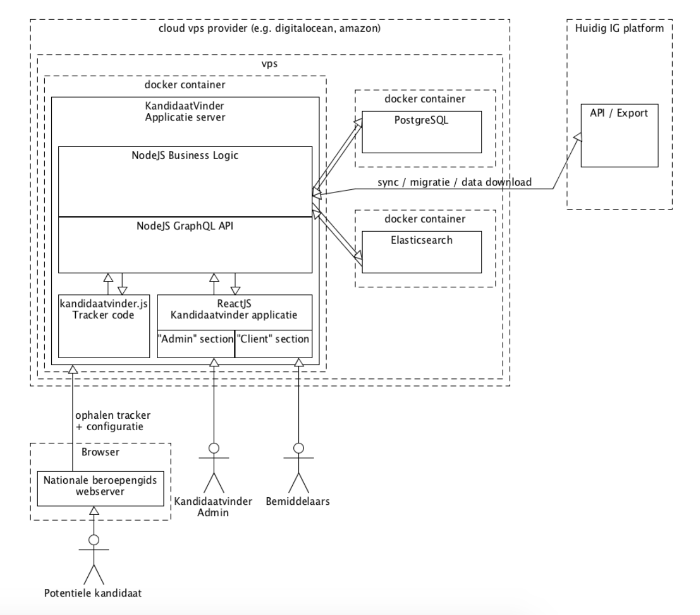
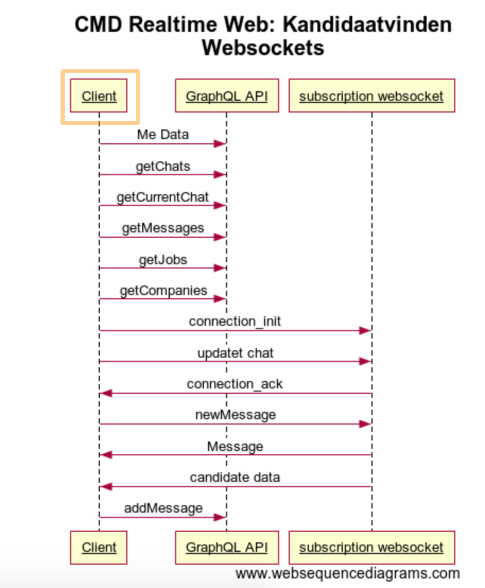

# Project 3 @cmda-minor-web · 2018-2019

## Concept
Voor de site van [freshheroes](https://freshheroes.com/), heb ik een toepassing bedacht waarbij een bedrijf een real-time coding 
challenge met de potentiele stagiair kan houden.

In de huidige versie van de app wordt de javascript uitgevoerd op elke client die is verbonden met de app. Dit maakt het 
erg onveilig. 

## Onderzoek
### GraphQL
Wat gebeurt er zodra een intermediair inlogt? 
De volgende GraphQL POST requests worden gedaan: 
* meData
Output Voorbeeld:
```javascript
{
  "data": {
    "me": {
      "id": 8,
      "firstName": "Lacey",
      "email": "9@moderator.lifely.nl",
      "moderator": {
        "id": 10,
        "agency": {
          "id": 2,
          "name": "Teqoia",
          "privacyUrl": null,
          "__typename": "AgencyType"
        },
        "__typename": "ModeratorType"
      },
      "picture": null,
      "__typename": "PersonType"
    }
  }
}
```
* getChats 
* getCurrentChat
* getMessages
* getJobs
* getCompanies

### Interaction diagram 

(credits: Lifely)

### sequence diagram



